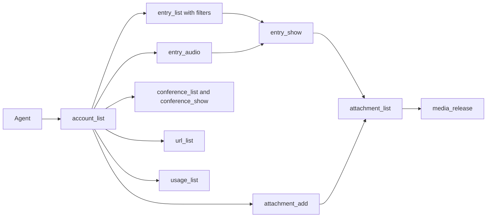

# Missing agent CLI commands

Existing doors, all `--json` capable: `entry_list`, `entry_show`, `entry_create`, `entry_update`, `entry_delete`, `url_list`, `media_release`. They live in [docs/commands.md](docs/commands.md) and are registered in [AGENTS.md](AGENTS.md). Logic stays in `services.py`; commands stay thin.

What an agent can do today is diary text CRUD, plus list URL rows and delete a file if it already knows the path. Several stored domains have no command at all.

## Add these

**`account_list`** (`src/accounts`). Every other command requires `--email`, and nothing lists accounts. Print `email` and `is_google_account` only. Do not print tokens from `UserSecret`.

**`conference_list` and `conference_show`** (`src/conference`). Conferences and segments have models and services (`list_conferences`, `conference_payload`) and no CLI. List: id, status, started_at, ended_at, duration, segment count, no full transcript. Show: joined `content_text` plus segments in sequence order (sequence, text, transcription error, durations). No delete: `Conference` has no soft-delete, and the UI has none.

**`attachment_list`** (`src/diary`). `media_release` needs a path under `media/`. `entry_show` returns filenames only ([entry_show_item](src/diary/services.py) around line 405). List active attachments for `--email`, optional `--entry <id>`: id, entry id, original filename, mime type, `relative_path`, uploaded_at. That path is what `media_release` already accepts.

**`attachment_add`** (`src/diary`). Store a file from a local path. Same two doors as the entries page (`upload_files`): with `--entry <id>`, call `store_attachments` on that active entry; without it, call `ingest_files`, which creates one `item_type=file` entry and sets `content_text` to the filename. One path per call. `--email` required. `--json` prints the entry payload. Do not classify and do not transcribe. An audio file passed here is stored as an attachment.

**`entry_audio`** (`src/diary`). One local audio file, diary recorder path only. Read the path into a `SimpleUploadedFile` and call `ingest_audio` with no duration override, no `recording_group_id`, and no extra files. Do not change `ingest_audio`, `transcribe_audio`, `strip_silence`, or the voice upload view. The browser still posts to `/voice/upload/`. This command does not split at 240 seconds: one file becomes one audio entry, then silence removal, transcription, classification, and a usage row, same as a recording. If `ffprobe` returns no duration, the entry stays out of prior context, which is the existing rule. Conference segments are not this command. Tests patch `transcribe_audio`, `probe_duration_seconds`, `strip_silence`, and `decide`, as in [test_attachment_views.py](src/diary/tests/test_attachment_views.py). `call_command` makes the test `integration`.

**`usage_list`** (`src/diary`). `UsageLog` is written on transcribe and classify and never readable. List for `--email`, optional `--entry` and `--limit`: service, usage type, amount, created_at, entry id. This is how an agent checks that a call ran.

## Change `entry_list`, do not add `entry_search`

[entry_list](src/diary/management/commands/entry_list.py) returns every active row and the full `content_text`. [url_list](src/urls_others/management/commands/url_list.py) already has `--kind` and `--limit`. Add the same idea here:

- `--limit`
- `--q` substring on `content_text`
- `--intent`, `--subject`, `--route`, `--item-type`

Keep the current JSON shape so existing callers still parse it.

## Documentation

Update both inventories in the same change as the commands. They are how the next agent finds the doors.

- [docs/commands.md](docs/commands.md) — one section per command: location, run line, what it does. Add `account_list`, `conference_list`, `conference_show`, `attachment_list`, `attachment_add`, `entry_audio`, `usage_list`, `entry_delete_last`, and `entry_restore`. Rewrite the `entry_list` section so the new flags are on the run line. On `entry_audio`, say it is one file, it is not split at 240 seconds, and it is not `attachment_add`. On `url_list`, say a row whose entry is soft-deleted is omitted.
- [AGENTS.md](AGENTS.md) — one line each under Commands: purpose plus flags. Same nine additions, the existing `entry_list` line updated for `--limit`, `--q`, and the filters, and the `url_list` line updated for the soft-deleted entry rule.

Do not add a session handoff here. That file is updated at the end of the session, not as part of this command set.

## Delete last and restore

Not a duplicate. [entry_delete](src/diary/management/commands/entry_delete.py) soft-deletes one entry by id. There is no “last entry” command and no restore.

What delete does today, in [delete_entry](src/diary/services.py): the entry row stays, `is_deleted` is set, and each attachment file is unlinked from disk before that attachment row is soft-deleted. Recording files under `media/recordings/` and `media/artifacts/` are not removed. Reference rows in `src.urls_others` have no `is_deleted` field. They stay in the table, and `url_list` still prints them, because the foreign key only cascades when the entry row is actually removed.

The human loop is delete, change mind, restore, change mind again. That second change of mind is another delete. No separate redo command.

**`entry_delete_last`** (`src/diary`). `--email` required. Soft-delete the newest active diary entry for that account (`created_at`, not a conference). Flip `is_deleted` on that entry only. Do not unlink attachment files and do not soft-delete attachment rows. `--json` prints the entry id. `entry_delete` by id stays as it is and still frees attachment files.

**`entry_restore`** (`src/diary`). `--email` required. With no id, clear `is_deleted` on the newest soft-deleted entry for that account (`deleted_at`). With an id, do that for that entry when it belongs to the account and is soft-deleted. An unknown or still-active id is an error. This does not recreate files. An entry removed with `entry_delete` comes back as text; its attachment rows stay deleted because those files are already gone. An entry removed with `entry_delete_last` comes back with its files, because those rows and bytes were left in place.

**URL rows.** Do not add `is_deleted` on Reference and do not hard-delete the rows. Hard delete cannot be undone, and a second flag would have to be kept in step with the entry. `url_list` skips a row whose entry is soft-deleted. Restore makes the entry active, so the same rows show again. That is the deletion the agent sees, and it is the undo.

## Leave out for now

- A redo command. Delete again after restore.
- `url_show` / `url_update` — `url_list` already returns id, kind, value, note, entry id, and status. Title, description, and transcript stay empty until fetch exists.
- `entry_reclassify` — `entry_update` skips classification on purpose.
- Conference audio from the CLI. A conference is segments under `ingest_segment`, not `ingest_audio`.
- Anything that prints Google tokens.
