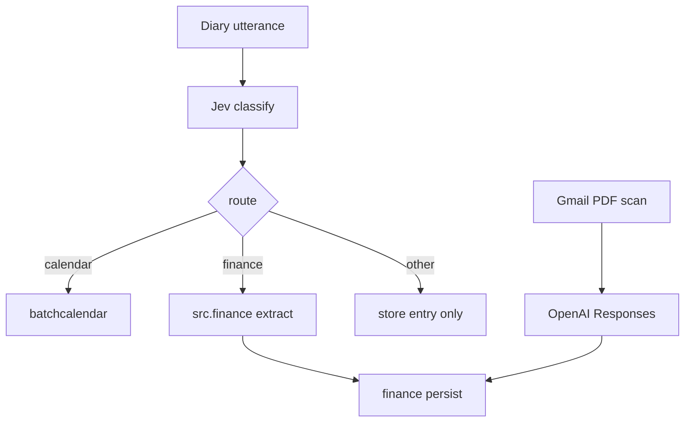

# Finance records and Gmail PDF invoices

Yes, keep them as two apps. The records do not depend on how the money was captured. A later image invoice parser should call the same persist function the PDF path uses, without a third app and without putting Gmail or PDF code inside the records app.

The sample invoice parser searches **Gmail** (subjects `invoice`, `fatura`, `recibo`, and the Portuguese variants), not Drive. Gmail scopes are already requested in [src/accounts/google.py](src/accounts/google.py). There is no Celery in this repo, so the invoice scan is a management command, not a 10-minute beat task.

Detection of a financial utterance already exists. Jev subject `finance` is stored, and [derive_route](src/diary/services.py) returns `finance` unless a calendar intent or subject wins. Nothing runs after that today. Calendar is the pattern to copy: after classify, [\_book_calendar_if_needed](src/diary/services.py) calls another app.

## `src.finance`

Models, following the sample’s `FinancialRecord` / `FinancialItem` but linked to `diary.Entry` instead of `IngestItem`:

- `FinancialRecord`: user, source entry (nullable, for invoices that are not a diary utterance), record name, context, status (`success` / `failed`), raw JSON, soft-delete.
- `FinancialItem`: expense or income, amount, currency (default EUR), category, merchant, transaction date, description, payment method.

`extract_financial_items(user, entry)` runs only when `entry.route == "finance"`. One OpenAI Chat Completions call, same style as [src/batchcalendar/extract.py](src/batchcalendar/extract.py): timezone `Europe/Lisbon`, prompt adapted from the sample (record name, context, ordered items; empty result is a failed record, not an exception that drops the diary entry). Tokens go on the diary `UsageLog` with service `finance`.

Hook it beside the calendar call in `ingest_text` and the voice ingest path in [src/diary/services.py](src/diary/services.py).

Show the items on the entries card the way calendar bookings are shown in [src/diary/templates/diary/list.html](src/diary/templates/diary/list.html). CLI: `finance_list --email` (`--entry`, `--json`), registered in [docs/commands.md](docs/commands.md) and [AGENTS.md](AGENTS.md).

## `src.invoiceparser`

Gmail only, for now:

- Search inbox for the sample trigger words, excluding messages already labeled `Facturas/Processadas` (the label name in the sample config).
- Download `application/pdf` attachments with the user’s Google token from [google_access_token](src/accounts/services.py), using `urllib` the way [src/batchcalendar/google_calendar.py](src/batchcalendar/google_calendar.py) calls Calendar.
- Send each PDF to OpenAI Responses (`input_file`), using the sample extraction schema: vendor, invoice number, dates, currency, line items, totals.
- `persist_parsed_invoice(user, parsed, source)` in `src.finance` writes one record (vendor as the name, payable total as the item, line items kept on the raw JSON). The PDF function and a future image function both call this. Do not add an image parser in this change.
- After a successful persist, add the processed label and do not insert the same Gmail message again (`external_id` = message id).
- CLI: `invoice_parse --email` (`--json`). No admin test page, no Celery.

## Tests and docs

Unit tests for extraction normalization, the diary hook (finance route calls extract; calendar route does not), and invoice query/persist with Gmail and OpenAI mocked. Tag every test `unit` or `integration` per the pytest marker rule.

Update [docs/project-plan.md](docs/project-plan.md) and [docs/handoff.md](docs/handoff.md): finance records and Gmail PDF invoices move out of the untouched backlog; image invoices stay later.
