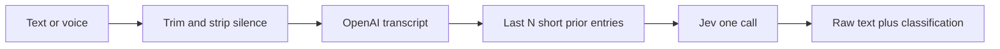

# Phase one: input and classify

Build this in the new tree at the repo root. Read [`sample-old-version-delete-when-finished-using/`](sample-old-version-delete-when-finished-using/) for behavior. Do not edit it, and do not copy its layout in as the app.

## What this phase stores

One Google-authenticated user on a VPS. No Stripe. Each entry keeps the original language.

Voice uses the sample transcription path: [`transcription/services.py`](sample-old-version-delete-when-finished-using/src/transcription/services.py) calls OpenAI with `AI_OPENAI_API_KEY`. Keys and Google credentials stay in `.env`, never in git. Add names to [`.env.example`](.env.example) only.

Jev is one HTTP call. It does not receive audio and it does not write venue, day, or time. Questions:

- Choice `intent`: freeform, list, follow-up, todo, reschedule
- Choice `subject`: diary, finance, appointment
- Yes/no `user_asked_for_diary`
- Yes/no `continues_prior`

State sent to Jev is the new text plus prior entries. Use prior entries only after two rows exist. Default count is 2, from `PRIOR_ENTRY_COUNT`. Include a prior row only when its recording is shorter than `RECORDER_MAX_DURATION`.

Stored route: if `intent` is follow-up or reschedule, or `subject` is appointment, the route is `calendar`. That wins even when `user_asked_for_diary` is true. The yes/no answer is still stored. Otherwise the route follows the subject.

## Usage accounting

No quota gate and no Stripe charge in this phase. Still record what each call consumed, on a per-user log tied to the entry. The log has service, usage type, and amount. Phase two writes into the same log.

Transcription does not return a token count. [`transcription/services.py`](sample-old-version-delete-when-finished-using/src/transcription/services.py) reads `text`, and sometimes `language` and `duration`. The sample then logs `audio_minutes` from that duration in [`ingestion/tasks.py`](sample-old-version-delete-when-finished-using/src/ingestion/tasks.py). Phase one stores audio minutes the same way. Do not invent a transcription token count.

Jev does return tokens. Each response includes `usage.input_tokens` and `usage.output_tokens` ([Jev API docs](https://jevtypesafeai.com/docs)). Store both. Output tokens are reported and are not billed.

## Later work

### Phase two — summary

After a phase-one entry is stored and classified. Run only when conditions are met. Those conditions are not defined yet. The summarizer is a text model, so its response has input and output tokens. Write those to the usage log from phase one.

### Phase three — some of the backlog

Phase three takes some of the items below, not all of them. Which ones is decided when that phase starts.

### Backlog

Kept so they are not forgotten:

- Translation
- Retrieval and chat
- GIGO
- Quotas
- Stripe
- Taxonomy verifier
- List, todo, finance, and calendar records
- Venue, day, and time extraction (Jev cannot write these)
- Context, time, and governance taxonomy dimensions
- Celery, Redis, and pipeline WebSockets
- Gmail, Drive, and Calendar API calls (full OAuth scopes are still requested in phase one so the token is already granted)

## Login

Port the sample’s full Google OAuth, not a login-only subset. Scopes are `FULL_SCOPES` in [`google_account/config.py`](sample-old-version-delete-when-finished-using/src/common/google_account/config.py): OpenID, email, profile, Gmail, Drive, and Calendar.

New `accounts` app:

- Google login, callback, link confirmation, connect, and disconnect, following [`google_urls.py`](sample-old-version-delete-when-finished-using/src/accounts/google_urls.py)
- Encrypt the refresh token with `MASTER_ENCRYPTION_KEY`
- Redirect URI from `GOOGLE_OAUTH_REDIRECT_URI`
- Entry pages require this login

Email/password registration, account deletion, and billing stay out.

## Entry path

New `diary` app. Views call `diary/services.py` only.

The voice page and the text page keep the input behavior they have now. Source of that behavior: [`recordings/index.html`](sample-old-version-delete-when-finished-using/src/templates/recordings/index.html), [`audio_recorder.js`](sample-old-version-delete-when-finished-using/src/static/recordings/js/audio_recorder.js), and [`text_input/index.html`](sample-old-version-delete-when-finished-using/src/templates/text_input/index.html). Bring those screens into the new app. Do not replace them with a shorter recorder.

What the voice screen does today, and what phase one keeps:

- Swipe between voice and text.
- Record, pause, and resume. The on-screen timer keeps running across a resume.
- If a call or another app takes the microphone, the recording auto-pauses. The user resumes manually. On iOS the take continues on a new microphone, and the parts are merged in the browser into one recording at stop.
- Completed parts are kept in IndexedDB. A reload or crash recovers them and uploads one recording. Only the in-progress segment can be lost.
- Toasts for a segment restart and for a multi-part take.

The segment cap is one setting, `RECORDER_MAX_DURATION`, default 240. That is the existing `RecorderConfig.max_duration` in [`common/config/settings.py`](sample-old-version-delete-when-finished-using/src/common/config/settings.py). The server passes it into the page as `maxDuration`. The browser uses that value. The `?? 240` in `audio_recorder.js` is only a fallback when the page does not pass a value. The page always passes the setting, so the live restart interval is not a second hard-coded 240.

When the recording reaches that many seconds, the current clip is saved and a new one starts on the same microphone until the user stops. `0` means no automatic restart. The same setting is what phase one uses to decide which prior entries are short enough to send to Jev. Later features that already read this cap, including the edit-modal recorder, keep using this setting when they are built. They are not a separate number.

After upload: trim and strip silence with ffmpeg, transcribe, and store the original text plus two durations in seconds: original recording length, and length after silence removal. Do not store file size in bytes.

Text: the current text-entry screen, storing the trimmed text on an entry for the logged-in user.

Classify in the same flow, after the text exists. A few seconds is acceptable. There is no summary step before Jev. Pipeline WebSockets stay out, so the page shows a simple processing state instead of the old live status socket.

A listing shows that user’s raw text, route, intent, and subject. It does not show a summary or calendar fields. Inline rewrite, quotas, and the speech guard are not part of this input screen.

Model fields to keep: owner, item type, original text, original duration in seconds, duration after silence removal in seconds, timestamps, the four Jev answers, confidence, and the derived route. No original or processed file size in bytes.

## Config

Keep the existing [`config/`](config/) package. Do not rename it to `conf/` in this phase. SQLite stays for this phase.

New `.env.example` names: `AI_OPENAI_API_KEY`, `GOOGLE_CLIENT_ID`, `GOOGLE_CLIENT_SECRET`, `GOOGLE_OAUTH_REDIRECT_URI`, `MASTER_ENCRYPTION_KEY`, `JEV_API_KEY`, `PRIOR_ENTRY_COUNT`, `RECORDER_MAX_DURATION`.

## Tests

Unit tests for the prior-entry selector and the calendar-wins rule. Tag them `@pytest.mark.unit`. Add root `pytest.ini` and `conftest.py` as required by [`.cursor/rules/pytest-markers.mdc`](.cursor/rules/pytest-markers.mdc).

## Docs

Write phase one, phase two, and the phase-three backlog into [`docs/project-plan.md`](docs/project-plan.md), which is empty today.
